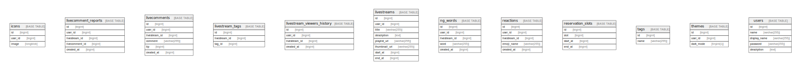

# isucon

## Tables

| Name | Columns | Comment | Type |
| ---- | ------- | ------- | ---- |
| [icons](icons.md) | 3 |  | BASE TABLE |
| [livecomment_reports](livecomment_reports.md) | 5 |  | BASE TABLE |
| [livecomments](livecomments.md) | 6 |  | BASE TABLE |
| [livestream_tags](livestream_tags.md) | 3 |  | BASE TABLE |
| [livestream_viewers_history](livestream_viewers_history.md) | 4 |  | BASE TABLE |
| [livestreams](livestreams.md) | 8 |  | BASE TABLE |
| [ng_words](ng_words.md) | 5 |  | BASE TABLE |
| [reactions](reactions.md) | 5 |  | BASE TABLE |
| [reservation_slots](reservation_slots.md) | 4 |  | BASE TABLE |
| [tags](tags.md) | 2 |  | BASE TABLE |
| [themes](themes.md) | 3 |  | BASE TABLE |
| [user_stats](user_stats.md) | 4 |  | BASE TABLE |
| [users](users.md) | 5 |  | BASE TABLE |

## Relations

---

> Generated by [tbls](https://github.com/k1LoW/tbls)
