# isucon13
## Local環境

docker-compose:

```console
$ docker compose up
```

DBを落とす

```console
$
```


## neofetch

```console
            .-/+oossssoo+/-.               isucon@ip-192-168-0-11
        `:+ssssssssssssssssss+:`           ----------------------
      -+ssssssssssssssssssyyssss+-         OS: Ubuntu 22.04.3 LTS x86_64
    .ossssssssssssssssssdMMMNysssso.       Host: c5.large
   /ssssssssssshdmmNNmmyNMMMMhssssss/      Kernel: 6.2.0-1016-aws
  +ssssssssshmydMMMMMMMNddddyssssssss+     Uptime: 17 mins
 /sssssssshNMMMyhhyyyyhmNMMMNhssssssss/    Packages: 820 (dpkg), 6 (snap)
.ssssssssdMMMNhsssssssssshNMMMdssssssss.   Shell: bash 5.1.16
+sssshhhyNMMNyssssssssssssyNMMMysssssss+   Terminal: /dev/pts/1
ossyNMMMNyMMhsssssssssssssshmmmhssssssso   CPU: Intel Xeon Platinum 8275CL (2) @ 3.599GHz
ossyNMMMNyMMhsssssssssssssshmmmhssssssso   GPU: 00:03.0 Amazon.com, Inc. Device 1111
+sssshhhyNMMNyssssssssssssyNMMMysssssss+   Memory: 828MiB / 3695MiB
.ssssssssdMMMNhsssssssssshNMMMdssssssss.
 /sssssssshNMMMyhhyyyyhdNMMMNhssssssss/
  +sssssssssdmydMMMMMMMMddddyssssssss+
   /ssssssssssshdmNNNNmyNMMMMhssssss/
    .ossssssssssssssssssdMMMNysssso.
      -+sssssssssssssssssyyyssss+-
        `:+ssssssssssssssssss+:`
            .-/+oossssoo+/-.
```

## DB
### 接続情報

```
host: 127.0.0.1
port: 3306
user: isucon
password: isucon
database: isupipe
```

```console
$ mysql -h 127.0.0.1 -P 3306 -u isucon -p isupipe
Enter password: isucon
```

### レコード数

```sql
+---------------+--------------+----------------------------+------------+--------+---------+------------+------------+----------------+-------------+-----------------+--------------+-----------+----------------+---------------------+-------------+------------+-----------------+----------+----------------+---------------+
| TABLE_CATALOG | TABLE_SCHEMA | TABLE_NAME                 | TABLE_TYPE | ENGINE | VERSION | ROW_FORMAT | TABLE_ROWS | AVG_ROW_LENGTH | DATA_LENGTH | MAX_DATA_LENGTH | INDEX_LENGTH | DATA_FREE | AUTO_INCREMENT | CREATE_TIME         | UPDATE_TIME | CHECK_TIME | TABLE_COLLATION | CHECKSUM | CREATE_OPTIONS | TABLE_COMMENT |
+---------------+--------------+----------------------------+------------+--------+---------+------------+------------+----------------+-------------+-----------------+--------------+-----------+----------------+---------------------+-------------+------------+-----------------+----------+----------------+---------------+
| def           | isupipe      | icons                      | BASE TABLE | InnoDB |      10 | Dynamic    |          0 |              0 |       16384 |               0 |            0 |         0 |              1 | 2023-11-24 21:30:53 | NULL        | NULL       | utf8mb4_bin     |     NULL |                |               |
| def           | isupipe      | livecomment_reports        | BASE TABLE | InnoDB |      10 | Dynamic    |          0 |              0 |       16384 |               0 |            0 |         0 |              1 | 2023-11-24 21:30:53 | NULL        | NULL       | utf8mb4_bin     |     NULL |                |               |
| def           | isupipe      | livecomments               | BASE TABLE | InnoDB |      10 | Dynamic    |       1001 |            163 |      163840 |               0 |            0 |         0 |           1002 | 2023-11-24 21:30:53 | NULL        | NULL       | utf8mb4_bin     |     NULL |                |               |
| def           | isupipe      | livestream_tags            | BASE TABLE | InnoDB |      10 | Dynamic    |      10640 |             50 |      540672 |               0 |            0 |         0 |          10967 | 2023-11-24 21:30:53 | NULL        | NULL       | utf8mb4_bin     |     NULL |                |               |
| def           | isupipe      | livestream_viewers_history | BASE TABLE | InnoDB |      10 | Dynamic    |          0 |              0 |       16384 |               0 |            0 |         0 |              1 | 2023-11-24 21:30:53 | NULL        | NULL       | utf8mb4_bin     |     NULL |                |               |
| def           | isupipe      | livestreams                | BASE TABLE | InnoDB |      10 | Dynamic    |       7179 |            367 |     2637824 |               0 |            0 |   4194304 |           7496 | 2023-11-24 21:30:53 | NULL        | NULL       | utf8mb4_bin     |     NULL |                |               |
| def           | isupipe      | ng_words                   | BASE TABLE | InnoDB |      10 | Dynamic    |      14163 |            112 |     1589248 |               0 |      1589248 |   4194304 |          14338 | 2023-11-24 21:30:53 | NULL        | NULL       | utf8mb4_bin     |     NULL |                |               |
| def           | isupipe      | reactions                  | BASE TABLE | InnoDB |      10 | Dynamic    |       1001 |             98 |       98304 |               0 |            0 |         0 |           1002 | 2023-11-24 21:30:53 | NULL        | NULL       | utf8mb4_bin     |     NULL |                |               |
| def           | isupipe      | reservation_slots          | BASE TABLE | InnoDB |      10 | Dynamic    |       8593 |             59 |      507904 |               0 |            0 |         0 |           8760 | 2023-11-24 21:30:53 | NULL        | NULL       | utf8mb4_bin     |     NULL |                |               |
| def           | isupipe      | tags                       | BASE TABLE | InnoDB |      10 | Dynamic    |        103 |            159 |       16384 |               0 |        16384 |         0 |            104 | 2023-11-24 21:30:53 | NULL        | NULL       | utf8mb4_bin     |     NULL |                |               |
| def           | isupipe      | themes                     | BASE TABLE | InnoDB |      10 | Dynamic    |       1000 |             65 |       65536 |               0 |            0 |         0 |           1001 | 2023-11-24 21:30:53 | NULL        | NULL       | utf8mb4_bin     |     NULL |                |               |
| def           | isupipe      | users                      | BASE TABLE | InnoDB |      10 | Dynamic    |       1005 |            407 |      409600 |               0 |        49152 |         0 |           1001 | 2023-11-24 21:30:53 | NULL        | NULL       | utf8mb4_bin     |     NULL |                |               |
+---------------+--------------+----------------------------+------------+--------+---------+------------+------------+----------------+-------------+-----------------+--------------+-----------+----------------+---------------------+-------------+------------+-----------------+----------+----------------+---------------+
12 rows in set (0.02 sec)
```

## 初期スコア
初期スコア Total Score	4,198

```
2023-11-25T01:05:44.256Z	info	isupipe-benchmarker	SSL接続が有効になっています
2023-11-25T01:05:44.256Z	info	isupipe-benchmarker	静的ファイルチェックを行います
2023-11-25T01:05:44.256Z	info	isupipe-benchmarker	静的ファイルチェックが完了しました
2023-11-25T01:05:44.256Z	info	isupipe-benchmarker	webappの初期化を行います
2023-11-25T01:06:04.021Z	info	isupipe-benchmarker	ベンチマーク走行前のデータ整合性チェックを行います
2023-11-25T01:06:35.813Z	info	isupipe-benchmarker	整合性チェックが成功しました
2023-11-25T01:06:35.813Z	info	isupipe-benchmarker	ベンチマーク走行を開始します
2023-11-25T01:07:35.814Z	info	isupipe-benchmarker	ベンチマーク走行を停止します
2023-11-25T01:07:35.815Z	warn	isupipe-benchmarker	ライブコメントを配信に投稿できないため、視聴者が離脱します	{"viewer": "chiyo150", "livestream_id": 7531, "error": "Post \"https://satomikobayashi0.u.isucon.dev:443/api/livestream/7531/livecomment\": context canceled: ベンチマーク走行が継続できないエラーが発生しました"}
2023-11-25T01:07:35.815Z	warn	isupipe-benchmarker	ライブコメントを配信に投稿できないため、視聴者が離脱します	{"viewer": "chiyo890", "livestream_id": 7553, "error": "Post \"https://utakahashi0.u.isucon.dev:443/api/livestream/7553/livecomment\": context canceled: ベンチマーク走行が継続できないエラーが発生しました"}
2023-11-25T01:07:35.815Z	warn	isupipe-benchmarker	ライブコメントを配信に投稿できないため、視聴者が離脱します	{"viewer": "minoru671", "livestream_id": 7554, "error": "Post \"https://yuitakahashi0.u.isucon.dev:443/api/livestream/7554/livecomment\": context canceled: ベンチマーク走行が継続できないエラーが発生しました"}
2023-11-25T01:07:35.815Z	warn	isupipe-benchmarker	ライブコメントを配信に投稿できないため、視聴者が離脱します	{"viewer": "junishikawa0", "livestream_id": 7529, "error": "Post \"https://kanasasaki0.u.isucon.dev:443/api/livestream/7529/livecomment\": context canceled: ベンチマーク走行が継続できないエラーが発生しました"}
2023-11-25T01:07:35.815Z	warn	isupipe-benchmarker	ライブコメントを配信に投稿できないため、視聴者が離脱します	{"viewer": "maaya610", "livestream_id": 7540, "error": "Post \"https://nakamurataro0.u.isucon.dev:443/api/livestream/7540/livecomment\": context canceled: ベンチマーク走行が継続できないエラーが発生しました"}
2023-11-25T01:07:35.817Z	warn	isupipe-benchmarker	ライブコメントを配信に投稿できないため、視聴者が離脱します	{"viewer": "zsuzuki0", "livestream_id": 7536, "error": "Post \"https://satomikobayashi0.u.isucon.dev:443/api/livestream/7536/livecomment\": context canceled: ベンチマーク走行が継続できないエラーが発生しました"}
2023-11-25T01:07:35.984Z	info	isupipe-benchmarker	ベンチマーク走行終了
2023-11-25T01:07:35.984Z	info	isupipe-benchmarker	最終チェックを実施します
2023-11-25T01:07:35.984Z	info	isupipe-benchmarker	最終チェックが成功しました
2023-11-25T01:07:35.984Z	info	isupipe-benchmarker	重複排除したログを以下に出力します
2023-11-25T01:07:35.984Z	info	isupipe-benchmarker	配信を最後まで視聴できた視聴者数	{"viewers": 19}

[一般エラー] POST /api/livestream/7522/livecomment/1013/report へのリクエストに対して、期待されたHTTPステータスコードが確認できませんでした (expected:201, actual:404)
[一般エラー] POST /api/livestream/7522/livecomment/1012/report へのリクエストに対して、期待されたHTTPステータスコードが確認できませんでした (expected:201, actual:404)
canceled
[リクエストタイムアウト] GET /api/user/yamazakikyosuke0/statistics: Get "https://pipe.u.isucon.dev:443/api/user/yamazakikyosuke0/statistics": context deadline exceeded (Client.Timeout exceeded while awaiting headers): タイムアウトによりリクエスト失敗
[リクエストタイムアウト] GET /api/user/satomikobayashi0/statistics: Get "https://pipe.u.isucon.dev:443/api/user/satomikobayashi0/statistics": context deadline exceeded (Client.Timeout exceeded while awaiting headers): タイムアウトによりリクエスト失敗
[リクエストタイムアウト] GET /api/user/nakamurataro0/statistics: Get "https://pipe.u.isucon.dev:443/api/user/nakamurataro0/statistics": context deadline exceeded (Client.Timeout exceeded while awaiting headers): タイムアウトによりリクエスト失敗
[リクエストタイムアウト] POST /api/livestream/reservation: Post "https://dokada2.u.isucon.dev:443/api/livestream/reservation": read udp 10.0.36.97:47524->13.113.224.90:53: i/o timeout: タイムアウトによりリクエスト失敗
[リクエストタイムアウト] GET /api/user/chiyo890/icon: Get "https://pipe.u.isucon.dev:443/api/user/chiyo890/icon": read udp 10.0.36.97:41607->13.113.224.90:53: i/o timeout: タイムアウトによりリクエスト失敗
[リクエストタイムアウト] GET /api/user/minoru671/icon: Get "https://pipe.u.isucon.dev:443/api/user/minoru671/icon": read udp 10.0.36.97:48239->13.113.224.90:53: i/o timeout: タイムアウトによりリクエスト失敗
名前解決成功数 2474
売上: 4198
```

## isucrud
```sql
delete(icons): delete from icons where user_id = ?
insert(icons): insert into icons (user_id, image) values (?, ?)
select(users): select * from users where name = ?
select(users): select * from users where name = ?
select(users): select * from users
select(users): select count(*) from users u
    inner join livestreams l on l.user_id = u.id
    inner join reactions r on r.livestream_id = l.id
    where u.name = ?

select(livestreams): select count(*) from users u
    inner join livestreams l on l.user_id = u.id
    inner join reactions r on r.livestream_id = l.id
    where u.name = ?

select(reactions): select count(*) from users u
    inner join livestreams l on l.user_id = u.id
    inner join reactions r on r.livestream_id = l.id
    where u.name = ?

select(livestreams): select * from livestreams where user_id = ?
select(livecomments): select * from livecomments where livestream_id = ?
select(livestream_viewers_history): select count(*) from livestream_viewers_history where livestream_id = ?
select(livecomments): select * from livecomments where livestream_id = ? order by created_at desc
select(livestreams): select * from livestreams where id = ? and user_id = ?
insert(ng_words): insert into ng_words(user_id, livestream_id, word, created_at) values (:user_id, :livestream_id, :word, :created_at)
select(ng_words): select * from ng_words where livestream_id = ?
select(livecomments): select * from livecomments
select(livecomments): select ifnull(sum(tip), 0) from livecomments
select(ng_words): select * from ng_words where user_id = ? and livestream_id = ? order by created_at desc
select(themes): select * from themes where user_id = ?
select(icons): select image from icons where user_id = ?
select(livestreams): select * from livestreams where id = ?
select(livecomments): select * from livecomments where id = ?
insert(livecomment_reports): insert into livecomment_reports(user_id, livestream_id, livecomment_id, created_at) values (:user_id, :livestream_id, :livecomment_id, :created_at)
select(users): select * from users where name = ?
select(livestreams): select * from livestreams where user_id = ?
insert(reactions): insert into reactions (user_id, livestream_id, emoji_name, created_at) values (:user_id, :livestream_id, :emoji_name, :created_at)
select(tags): select * from tags
select(users): select id from users where name = ?
select(themes): select * from themes where user_id = ?
select(livestreams): select * from livestreams where id = ?
select(ng_words): select id, user_id, livestream_id, word from ng_words where user_id = ? and livestream_id = ?
insert(livecomments): insert into livecomments (user_id, livestream_id, comment, tip, created_at) values (:user_id, :livestream_id, :comment, :tip, :created_at)
insert(users): insert into users (name, display_name, description, password) values(:name, :display_name, :description, :password)
insert(themes): insert into themes (user_id, dark_mode) values(:user_id, :dark_mode)
select(users): select * from users where id = ?
select(livestreams): select * from livestreams where id = ?
insert(livestream_viewers_history): insert into livestream_viewers_history (user_id, livestream_id, created_at) values(:user_id, :livestream_id, :created_at)
select(reservation_slots): select * from reservation_slots where start_at >= ? and end_at <= ? for update
select(reservation_slots): select slot from reservation_slots where start_at = ? and end_at = ?
update(reservation_slots): update reservation_slots set slot = slot - 1 where start_at >= ? and end_at <= ?
insert(livestreams): insert into livestreams (user_id, title, description, playlist_url, thumbnail_url, start_at, end_at) values(:user_id, :title, :description, :playlist_url, :thumbnail_url, :start_at, :end_at)
insert(livestream_tags): insert into livestream_tags (livestream_id, tag_id) values (:livestream_id, :tag_id)
select(users): select * from users where id = ?
select(livecomments): select * from livecomments where id = ?
select(users): select * from users where name = ?
select(icons): select image from icons where user_id = ?
select(livestreams): select * from livestreams where user_id = ?
select(users): select * from users where id = ?
select(livestreams): select * from livestreams where id = ?
select(users): select * from users where id = ?
select(livestream_tags): select * from livestream_tags where livestream_id = ?
select(tags): select * from tags where id = ?
select(tags): select id from tags where name = ?
select(livestream_tags): select * from livestream_tags where tag_id in (?) order by livestream_id desc
select(livestreams): select * from livestreams where id = ?
select(livestreams): select * from livestreams order by id desc
select(livestreams): select * from livestreams where id = ?
delete(livestream_viewers_history): delete from livestream_viewers_history where user_id = ? and livestream_id = ?
select(users): select * from users where id = ?
select(users): select * from users where name = ?
select(livestreams): select * from livestreams where id = ?
select(livecomment_reports): select * from livecomment_reports where livestream_id = ?
select(reactions): select * from reactions where livestream_id = ? order by created_at desc
select(livestreams): select * from livestreams where id = ?
select(livestreams): select * from livestreams
select(livestreams): select count(*) from livestreams l inner join reactions r on l.id = r.livestream_id where l.id = ?
select(reactions): select count(*) from livestreams l inner join reactions r on l.id = r.livestream_id where l.id = ?
select(livestreams): select ifnull(sum(l2.tip), 0) from livestreams l inner join livecomments l2 on l.id = l2.livestream_id where l.id = ?
select(livecomments): select ifnull(sum(l2.tip), 0) from livestreams l inner join livecomments l2 on l.id = l2.livestream_id where l.id = ?
select(livestreams): select count(*) from livestreams l inner join livestream_viewers_history h on h.livestream_id = l.id where l.id = ?
select(livestream_viewers_history): select count(*) from livestreams l inner join livestream_viewers_history h on h.livestream_id = l.id where l.id = ?
select(livestreams): select ifnull(max(tip), 0) from livestreams l inner join livecomments l2 on l2.livestream_id = l.id where l.id = ?
select(livecomments): select ifnull(max(tip), 0) from livestreams l inner join livecomments l2 on l2.livestream_id = l.id where l.id = ?
select(livestreams): select count(*) from livestreams l inner join reactions r on r.livestream_id = l.id where l.id = ?
select(reactions): select count(*) from livestreams l inner join reactions r on r.livestream_id = l.id where l.id = ?
select(livestreams): select count(*) from livestreams l inner join livecomment_reports r on r.livestream_id = l.id where l.id = ?
select(livecomment_reports): select count(*) from livestreams l inner join livecomment_reports r on r.livestream_id = l.id where l.id = ?
```

### DB Graph

```mermaid
graph LR
  classDef table fill:#795548,fill-opacity:0.5
  classDef func fill:#1976D2,fill-opacity:0.5
  func:github.com/isucon/isucon13/webapp/go.getIconHandler[getIconHandler]:::func --> table:icons[icons]:::table
  func:github.com/isucon/isucon13/webapp/go.getIconHandler[getIconHandler]:::func --> table:users[users]:::table
  func:github.com/isucon/isucon13/webapp/go.fillLivecommentResponse[fillLivecommentResponse]:::func --> func:github.com/isucon/isucon13/webapp/go.fillLivestreamResponse[fillLivestreamResponse]:::func
  func:github.com/isucon/isucon13/webapp/go.fillLivecommentResponse[fillLivecommentResponse]:::func --> func:github.com/isucon/isucon13/webapp/go.fillUserResponse[fillUserResponse]:::func
  func:github.com/isucon/isucon13/webapp/go.fillLivecommentResponse[fillLivecommentResponse]:::func --> table:livestreams[livestreams]:::table
  func:github.com/isucon/isucon13/webapp/go.fillLivecommentResponse[fillLivecommentResponse]:::func --> table:users[users]:::table
  func:GetPaymentResult[GetPaymentResult]:::func --> table:livecomments[livecomments]:::table
  func:github.com/isucon/isucon13/webapp/go.enterLivestreamHandler[enterLivestreamHandler]:::func --> table:livestream_viewers_history[livestream_viewers_history]:::table
  func:github.com/isucon/isucon13/webapp/go.getUserStatisticsHandler[getUserStatisticsHandler]:::func --> table:livecomments[livecomments]:::table
  func:github.com/isucon/isucon13/webapp/go.getUserStatisticsHandler[getUserStatisticsHandler]:::func --> table:livestream_viewers_history[livestream_viewers_history]:::table
  func:github.com/isucon/isucon13/webapp/go.getUserStatisticsHandler[getUserStatisticsHandler]:::func --> table:livestreams[livestreams]:::table
  func:github.com/isucon/isucon13/webapp/go.getUserStatisticsHandler[getUserStatisticsHandler]:::func --> table:reactions[reactions]:::table
  func:github.com/isucon/isucon13/webapp/go.getUserStatisticsHandler[getUserStatisticsHandler]:::func --> table:users[users]:::table
  func:github.com/isucon/isucon13/webapp/go.getNgwords[getNgwords]:::func --> table:ng_words[ng_words]:::table
  func:github.com/isucon/isucon13/webapp/go.getLivecommentReportsHandler[getLivecommentReportsHandler]:::func --> func:github.com/isucon/isucon13/webapp/go.fillLivecommentReportResponse[fillLivecommentReportResponse]:::func
  func:github.com/isucon/isucon13/webapp/go.getLivecommentReportsHandler[getLivecommentReportsHandler]:::func --> table:livecomment_reports[livecomment_reports]:::table
  func:github.com/isucon/isucon13/webapp/go.getLivecommentReportsHandler[getLivecommentReportsHandler]:::func --> table:livestreams[livestreams]:::table
  func:github.com/isucon/isucon13/webapp/go.getMyLivestreamsHandler[getMyLivestreamsHandler]:::func --> func:github.com/isucon/isucon13/webapp/go.fillLivestreamResponse[fillLivestreamResponse]:::func
  func:github.com/isucon/isucon13/webapp/go.getMyLivestreamsHandler[getMyLivestreamsHandler]:::func --> table:livestreams[livestreams]:::table
  func:github.com/isucon/isucon13/webapp/go.loginHandler[loginHandler]:::func --> table:users[users]:::table
  func:github.com/isucon/isucon13/webapp/go.fillLivestreamResponse[fillLivestreamResponse]:::func --> func:github.com/isucon/isucon13/webapp/go.fillUserResponse[fillUserResponse]:::func
  func:github.com/isucon/isucon13/webapp/go.fillLivestreamResponse[fillLivestreamResponse]:::func --> table:livestream_tags[livestream_tags]:::table
  func:github.com/isucon/isucon13/webapp/go.fillLivestreamResponse[fillLivestreamResponse]:::func --> table:tags[tags]:::table
  func:github.com/isucon/isucon13/webapp/go.fillLivestreamResponse[fillLivestreamResponse]:::func --> table:users[users]:::table
  func:github.com/isucon/isucon13/webapp/go.searchLivestreamsHandler[searchLivestreamsHandler]:::func --> func:github.com/isucon/isucon13/webapp/go.fillLivestreamResponse[fillLivestreamResponse]:::func
  func:github.com/isucon/isucon13/webapp/go.searchLivestreamsHandler[searchLivestreamsHandler]:::func --> table:livestream_tags[livestream_tags]:::table
  func:github.com/isucon/isucon13/webapp/go.searchLivestreamsHandler[searchLivestreamsHandler]:::func --> table:livestreams[livestreams]:::table
  func:github.com/isucon/isucon13/webapp/go.searchLivestreamsHandler[searchLivestreamsHandler]:::func --> table:tags[tags]:::table
  func:github.com/isucon/isucon13/webapp/go.getReactionsHandler[getReactionsHandler]:::func --> func:github.com/isucon/isucon13/webapp/go.fillReactionResponse[fillReactionResponse]:::func
  func:github.com/isucon/isucon13/webapp/go.getReactionsHandler[getReactionsHandler]:::func --> table:reactions[reactions]:::table
  func:github.com/isucon/isucon13/webapp/go.reportLivecommentHandler[reportLivecommentHandler]:::func --> func:github.com/isucon/isucon13/webapp/go.fillLivecommentReportResponse[fillLivecommentReportResponse]:::func
  func:github.com/isucon/isucon13/webapp/go.reportLivecommentHandler[reportLivecommentHandler]:::func --> table:livecomment_reports[livecomment_reports]:::table
  func:github.com/isucon/isucon13/webapp/go.reportLivecommentHandler[reportLivecommentHandler]:::func --> table:livecomments[livecomments]:::table
  func:github.com/isucon/isucon13/webapp/go.reportLivecommentHandler[reportLivecommentHandler]:::func --> table:livestreams[livestreams]:::table
  func:github.com/isucon/isucon13/webapp/go.postIconHandler[postIconHandler]:::func --> table:icons[icons]:::table
  func:github.com/isucon/isucon13/webapp/go.postIconHandler[postIconHandler]:::func --> table:icons[icons]:::table
  func:github.com/isucon/isucon13/webapp/go.getLivestreamHandler[getLivestreamHandler]:::func --> func:github.com/isucon/isucon13/webapp/go.fillLivestreamResponse[fillLivestreamResponse]:::func
  func:github.com/isucon/isucon13/webapp/go.getLivestreamHandler[getLivestreamHandler]:::func --> table:livestreams[livestreams]:::table
  func:github.com/isucon/isucon13/webapp/go.getLivecommentsHandler[getLivecommentsHandler]:::func --> func:github.com/isucon/isucon13/webapp/go.fillLivecommentResponse[fillLivecommentResponse]:::func
  func:github.com/isucon/isucon13/webapp/go.getLivecommentsHandler[getLivecommentsHandler]:::func --> table:livecomments[livecomments]:::table
  func:github.com/isucon/isucon13/webapp/go.getUserHandler[getUserHandler]:::func --> func:github.com/isucon/isucon13/webapp/go.fillUserResponse[fillUserResponse]:::func
  func:github.com/isucon/isucon13/webapp/go.getUserHandler[getUserHandler]:::func --> table:users[users]:::table
  func:github.com/isucon/isucon13/webapp/go.getTagHandler[getTagHandler]:::func --> table:tags[tags]:::table
  func:github.com/isucon/isucon13/webapp/go.fillUserResponse[fillUserResponse]:::func --> table:icons[icons]:::table
  func:github.com/isucon/isucon13/webapp/go.fillUserResponse[fillUserResponse]:::func --> table:themes[themes]:::table
  func:github.com/isucon/isucon13/webapp/go.reserveLivestreamHandler[reserveLivestreamHandler]:::func --> func:github.com/isucon/isucon13/webapp/go.fillLivestreamResponse[fillLivestreamResponse]:::func
  func:github.com/isucon/isucon13/webapp/go.reserveLivestreamHandler[reserveLivestreamHandler]:::func --> table:livestream_tags[livestream_tags]:::table
  func:github.com/isucon/isucon13/webapp/go.reserveLivestreamHandler[reserveLivestreamHandler]:::func --> table:livestreams[livestreams]:::table
  func:github.com/isucon/isucon13/webapp/go.reserveLivestreamHandler[reserveLivestreamHandler]:::func --> table:reservation_slots[reservation_slots]:::table
  func:github.com/isucon/isucon13/webapp/go.reserveLivestreamHandler[reserveLivestreamHandler]:::func --> table:reservation_slots[reservation_slots]:::table
  func:github.com/isucon/isucon13/webapp/go.reserveLivestreamHandler[reserveLivestreamHandler]:::func --> table:reservation_slots[reservation_slots]:::table
  func:github.com/isucon/isucon13/webapp/go.postReactionHandler[postReactionHandler]:::func --> func:github.com/isucon/isucon13/webapp/go.fillReactionResponse[fillReactionResponse]:::func
  func:github.com/isucon/isucon13/webapp/go.postReactionHandler[postReactionHandler]:::func --> table:reactions[reactions]:::table
  func:github.com/isucon/isucon13/webapp/go.postLivecommentHandler[postLivecommentHandler]:::func --> func:github.com/isucon/isucon13/webapp/go.fillLivecommentResponse[fillLivecommentResponse]:::func
  func:github.com/isucon/isucon13/webapp/go.postLivecommentHandler[postLivecommentHandler]:::func --> table:livecomments[livecomments]:::table
  func:github.com/isucon/isucon13/webapp/go.postLivecommentHandler[postLivecommentHandler]:::func --> table:livestreams[livestreams]:::table
  func:github.com/isucon/isucon13/webapp/go.postLivecommentHandler[postLivecommentHandler]:::func --> table:ng_words[ng_words]:::table
  func:github.com/isucon/isucon13/webapp/go.fillReactionResponse[fillReactionResponse]:::func --> func:github.com/isucon/isucon13/webapp/go.fillLivestreamResponse[fillLivestreamResponse]:::func
  func:github.com/isucon/isucon13/webapp/go.fillReactionResponse[fillReactionResponse]:::func --> func:github.com/isucon/isucon13/webapp/go.fillUserResponse[fillUserResponse]:::func
  func:github.com/isucon/isucon13/webapp/go.fillReactionResponse[fillReactionResponse]:::func --> table:livestreams[livestreams]:::table
  func:github.com/isucon/isucon13/webapp/go.fillReactionResponse[fillReactionResponse]:::func --> table:users[users]:::table
  func:github.com/isucon/isucon13/webapp/go.fillLivecommentReportResponse[fillLivecommentReportResponse]:::func --> func:github.com/isucon/isucon13/webapp/go.fillLivecommentResponse[fillLivecommentResponse]:::func
  func:github.com/isucon/isucon13/webapp/go.fillLivecommentReportResponse[fillLivecommentReportResponse]:::func --> func:github.com/isucon/isucon13/webapp/go.fillUserResponse[fillUserResponse]:::func
  func:github.com/isucon/isucon13/webapp/go.fillLivecommentReportResponse[fillLivecommentReportResponse]:::func --> table:livecomments[livecomments]:::table
  func:github.com/isucon/isucon13/webapp/go.fillLivecommentReportResponse[fillLivecommentReportResponse]:::func --> table:users[users]:::table
  func:github.com/isucon/isucon13/webapp/go.getMeHandler[getMeHandler]:::func --> func:github.com/isucon/isucon13/webapp/go.fillUserResponse[fillUserResponse]:::func
  func:github.com/isucon/isucon13/webapp/go.getMeHandler[getMeHandler]:::func --> table:users[users]:::table
  func:github.com/isucon/isucon13/webapp/go.getStreamerThemeHandler[getStreamerThemeHandler]:::func --> table:themes[themes]:::table
  func:github.com/isucon/isucon13/webapp/go.getStreamerThemeHandler[getStreamerThemeHandler]:::func --> table:users[users]:::table
  func:github.com/isucon/isucon13/webapp/go.getLivestreamStatisticsHandler[getLivestreamStatisticsHandler]:::func --> table:livecomment_reports[livecomment_reports]:::table
  func:github.com/isucon/isucon13/webapp/go.getLivestreamStatisticsHandler[getLivestreamStatisticsHandler]:::func --> table:livecomments[livecomments]:::table
  func:github.com/isucon/isucon13/webapp/go.getLivestreamStatisticsHandler[getLivestreamStatisticsHandler]:::func --> table:livestream_viewers_history[livestream_viewers_history]:::table
  func:github.com/isucon/isucon13/webapp/go.getLivestreamStatisticsHandler[getLivestreamStatisticsHandler]:::func --> table:livestreams[livestreams]:::table
  func:github.com/isucon/isucon13/webapp/go.getLivestreamStatisticsHandler[getLivestreamStatisticsHandler]:::func --> table:reactions[reactions]:::table
  func:github.com/isucon/isucon13/webapp/go.moderateHandler[moderateHandler]:::func --> table:livecomments[livecomments]:::table
  func:github.com/isucon/isucon13/webapp/go.moderateHandler[moderateHandler]:::func --> table:livestreams[livestreams]:::table
  func:github.com/isucon/isucon13/webapp/go.moderateHandler[moderateHandler]:::func --> table:ng_words[ng_words]:::table
  func:github.com/isucon/isucon13/webapp/go.moderateHandler[moderateHandler]:::func --> table:ng_words[ng_words]:::table
  func:github.com/isucon/isucon13/webapp/go.getUserLivestreamsHandler[getUserLivestreamsHandler]:::func --> func:github.com/isucon/isucon13/webapp/go.fillLivestreamResponse[fillLivestreamResponse]:::func
  func:github.com/isucon/isucon13/webapp/go.getUserLivestreamsHandler[getUserLivestreamsHandler]:::func --> table:livestreams[livestreams]:::table
  func:github.com/isucon/isucon13/webapp/go.getUserLivestreamsHandler[getUserLivestreamsHandler]:::func --> table:users[users]:::table
  func:github.com/isucon/isucon13/webapp/go.registerHandler[registerHandler]:::func --> func:github.com/isucon/isucon13/webapp/go.fillUserResponse[fillUserResponse]:::func
  func:github.com/isucon/isucon13/webapp/go.registerHandler[registerHandler]:::func --> table:themes[themes]:::table
  func:github.com/isucon/isucon13/webapp/go.registerHandler[registerHandler]:::func --> table:users[users]:::table
  func:github.com/isucon/isucon13/webapp/go.exitLivestreamHandler[exitLivestreamHandler]:::func --> table:livestream_viewers_history[livestream_viewers_history]:::table
  linkStyle 0,1,4,5,6,8,9,10,11,12,13,15,16,18,19,21,22,23,25,26,27,29,32,33,37,39,41,42,43,44,48,50,55,56,59,60,63,64,66,67,68,69,70,71,72,73,74,75,76,79,80 stroke:#78909C,stroke-width:2px
  linkStyle 2,3,14,17,20,24,28,30,36,38,40,45,51,53,57,58,61,62,65,78,81 stroke:#BBDEFB,stroke-width:2px
  linkStyle 7,31,35,46,47,52,54,77,82,83 stroke:#CDDC39,stroke-width:2px
  linkStyle 34,84 stroke:#F44336,stroke-width:2px
  linkStyle 49 stroke:#FF9800,stroke-width:2px
```

node:  `テーブル`  `関数`

edge:  `INSERT`  `UPDATE`  `DELETE`  `SELECT`  `関数呼び出し`

