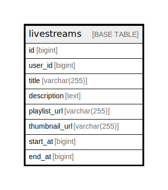

# livestreams

## Description

<details>
<summary><strong>Table Definition</strong></summary>

```sql
CREATE TABLE `livestreams` (
  `id` bigint NOT NULL AUTO_INCREMENT,
  `user_id` bigint NOT NULL,
  `title` varchar(255) CHARACTER SET utf8mb4 COLLATE utf8mb4_bin NOT NULL,
  `description` text CHARACTER SET utf8mb4 COLLATE utf8mb4_bin NOT NULL,
  `playlist_url` varchar(255) CHARACTER SET utf8mb4 COLLATE utf8mb4_bin NOT NULL,
  `thumbnail_url` varchar(255) CHARACTER SET utf8mb4 COLLATE utf8mb4_bin NOT NULL,
  `start_at` bigint NOT NULL,
  `end_at` bigint NOT NULL,
  PRIMARY KEY (`id`),
  KEY `idx_id_user_id` (`id`,`user_id`)
) ENGINE=InnoDB AUTO_INCREMENT=[Redacted by tbls] DEFAULT CHARSET=utf8mb4 COLLATE=utf8mb4_bin
```

</details>

## Columns

| Name | Type | Default | Nullable | Extra Definition | Children | Parents | Comment |
| ---- | ---- | ------- | -------- | ---------------- | -------- | ------- | ------- |
| id | bigint |  | false | auto_increment |  |  |  |
| user_id | bigint |  | false |  |  |  |  |
| title | varchar(255) |  | false |  |  |  |  |
| description | text |  | false |  |  |  |  |
| playlist_url | varchar(255) |  | false |  |  |  |  |
| thumbnail_url | varchar(255) |  | false |  |  |  |  |
| start_at | bigint |  | false |  |  |  |  |
| end_at | bigint |  | false |  |  |  |  |

## Constraints

| Name | Type | Definition |
| ---- | ---- | ---------- |
| PRIMARY | PRIMARY KEY | PRIMARY KEY (id) |

## Indexes

| Name | Definition |
| ---- | ---------- |
| idx_id_user_id | KEY idx_id_user_id (id, user_id) USING BTREE |
| PRIMARY | PRIMARY KEY (id) USING BTREE |

## Relations



---

> Generated by [tbls](https://github.com/k1LoW/tbls)
