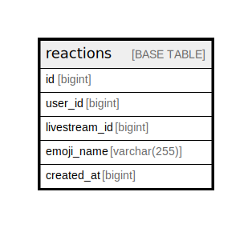

# reactions

## Description

<details>
<summary><strong>Table Definition</strong></summary>

```sql
CREATE TABLE `reactions` (
  `id` bigint NOT NULL AUTO_INCREMENT,
  `user_id` bigint NOT NULL,
  `livestream_id` bigint NOT NULL,
  `emoji_name` varchar(255) CHARACTER SET utf8mb4 COLLATE utf8mb4_bin NOT NULL,
  `created_at` bigint NOT NULL,
  PRIMARY KEY (`id`),
  KEY `lid_cat_desc` (`livestream_id`,`created_at` DESC)
) ENGINE=InnoDB AUTO_INCREMENT=[Redacted by tbls] DEFAULT CHARSET=utf8mb4 COLLATE=utf8mb4_bin
```

</details>

## Columns

| Name | Type | Default | Nullable | Extra Definition | Children | Parents | Comment |
| ---- | ---- | ------- | -------- | ---------------- | -------- | ------- | ------- |
| id | bigint |  | false | auto_increment |  |  |  |
| user_id | bigint |  | false |  |  |  |  |
| livestream_id | bigint |  | false |  |  |  |  |
| emoji_name | varchar(255) |  | false |  |  |  |  |
| created_at | bigint |  | false |  |  |  |  |

## Constraints

| Name | Type | Definition |
| ---- | ---- | ---------- |
| PRIMARY | PRIMARY KEY | PRIMARY KEY (id) |

## Indexes

| Name | Definition |
| ---- | ---------- |
| lid_cat_desc | KEY lid_cat_desc (livestream_id, created_at) USING BTREE |
| PRIMARY | PRIMARY KEY (id) USING BTREE |

## Relations



---

> Generated by [tbls](https://github.com/k1LoW/tbls)
