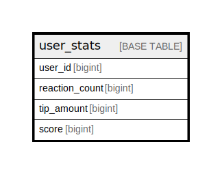

# user_stats

## Description

<details>
<summary><strong>Table Definition</strong></summary>

```sql
CREATE TABLE `user_stats` (
  `user_id` bigint NOT NULL,
  `reaction_count` bigint NOT NULL DEFAULT '0',
  `tip_amount` bigint NOT NULL DEFAULT '0',
  `score` bigint GENERATED ALWAYS AS ((`reaction_count` + `tip_amount`)) STORED,
  PRIMARY KEY (`user_id`),
  KEY `idx_score` (`score`)
) ENGINE=InnoDB DEFAULT CHARSET=utf8mb4 COLLATE=utf8mb4_bin
```

</details>

## Columns

| Name | Type | Default | Nullable | Extra Definition | Children | Parents | Comment |
| ---- | ---- | ------- | -------- | ---------------- | -------- | ------- | ------- |
| user_id | bigint |  | false |  |  |  |  |
| reaction_count | bigint | 0 | false |  |  |  |  |
| tip_amount | bigint | 0 | false |  |  |  |  |
| score | bigint |  | true | GENERATED ALWAYS AS (\`reaction_count\` + \`tip_amount\`) STORED |  |  |  |

## Constraints

| Name | Type | Definition |
| ---- | ---- | ---------- |
| PRIMARY | PRIMARY KEY | PRIMARY KEY (user_id) |

## Indexes

| Name | Definition |
| ---- | ---------- |
| idx_score | KEY idx_score (score) USING BTREE |
| PRIMARY | PRIMARY KEY (user_id) USING BTREE |

## Relations



---

> Generated by [tbls](https://github.com/k1LoW/tbls)
